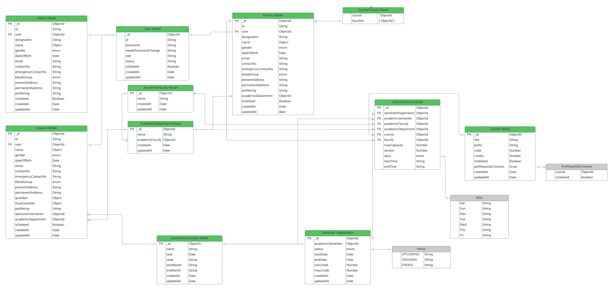

# University Management System Authentication Service

This is the documentation for the Authentication Service component of the University Management System. The Authentication Service provides authentication and authorization functionalities for the three main roles in the system: Admin, Student, and Faculty. It is built using TypeScript, Express.js, Zod validation, and MongoDB.

## Functional Requirements

### Student

- Student can login and log out.
- Student can manage and update their profile.
- Student can update certain fields.

### Admin

- Admin can log in and log out.
- Admin can manage and update their profile.
- Admin can only update certain fields.
- Admin can manage user accounts:
  - Change Password

### Faculty

- Faculty can log in and log out.
- Faculty can manage and update their profile.
- Faculty can only update certain fields.

## API Endpoints

### User

- `POST /users/create-student`
- `POST /users/create-faculty`
- `POST /users/create-admin`

### Student

- `GET /students`
- `GET /students?searchTerm=fr797`
- `GET /students?page=1&limit=10&sortBy=gender&sortOrder=asc`
- `GET /students/:id`
- `PATCH /students/:id`
- `DELETE /students/:id`

### Faculty

- `GET /faculties`
- `GET /faculties?searchTerm=john`
- `GET /faculties?page=1&limit=10&sortBy=gender&sortOrder=asc`
- `GET /faculties/:id`
- `PATCH /faculties/:id`
- `DELETE /faculties/:id`

### Admin

- `GET /admins`
- `GET /admins?searchTerm=us88`
- `GET /admins?page=1&limit=10&sortBy=gender&sortOrder=asc`
- `GET /admins/:id`
- `PATCH /admins/:id`
- `DELETE /admins/:id`

### Academic Semester

- `POST /academic-semesters/create-semester`
- `GET /academic-semesters`
- `GET /academic-semesters?searchTerm=fal`
- `GET /academic-semesters?page=1&limit=10&sortBy=year&sortOrder=asc`
- `GET /academic-semesters/:id`
- `PATCH /academic-semesters/:id`
- `DELETE /academic-semesters/:id`

### Academic Department

- `POST /academic-departments/create-department`
- `GET /academic-departments`
- `GET /academic-departments?searchTerm=math`
- `GET /academic-departments?page=1&limit=10&sortBy=title&sortOrder=asc`
- `GET /academic-departments/:id`
- `PATCH /academic-departments/:id`
- `DELETE /academic-departments/:id`

### Academic Faculty

- `POST /academic-faculties/create-faculty`
- `GET /academic-faculties`
- `GET /academic-faculties?searchTerm=com`
- `GET /academic-faculties?page=1&limit=10&sortBy=title&sortOrder=asc`
- `GET /academic-faculties/:id`
- `PATCH /academic-faculties/:id`
- `DELETE /academic-faculties/:id`

### Authentication

- `POST /auth/login`

### Requirement Analysis

[Link to Requirement Analysis Document](https://docs.google.com/document/d/10mkjS8boCQzW4xpsESyzwCCLJcM3hvLghyD_TeXPBx0/edit?usp=sharing)

Description: This document outlines the detailed analysis of project requirements.

---

### Entity-Relationship Diagrams

Description: This is an updated diagram illustrates the relationships among User, Student, Admin, Faculty, Academic Semester, Academic Faculty, Academic Department , Course , Semester Registration , Offered Couse.

---

Description: This is a postman collection of all the API endpoints.Download this , and import it in your postman if you needed.

---
